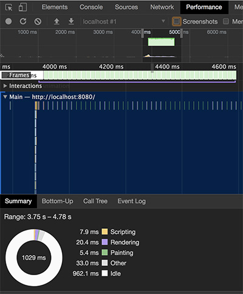
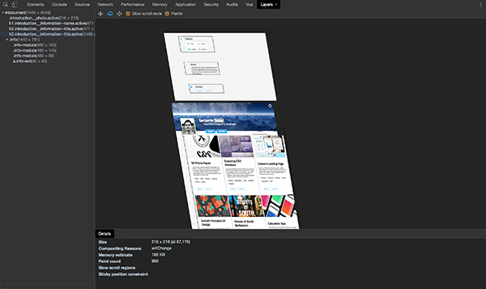

__Warning: Until I Push This Live on Github Pages__
You have to clone the repository and run locally. Simply
* Download Dependencies
```
npm install
```
* Run Dev Sever
```
npm run dev
```
* Build for production
```
npm run build
```

# Benjamin Taylor Portfolio

## Introduction
 Holy cow! I finally did it! After long months of wearing different hats, I am finally at a point where I can say that the first public verion of my portfolio is ready for the world. I also made a blog! I've built it with some pretty amazing open source technology. You can find a comprehensive list of features, challenges, and miscellaneous writing about my experience below.

# Features

## Vue.js + Vue Router
I embraced Vue.js as a step up from working with regular Javascript, partly due to it's progressive nature and my own curiosity. I started with simple string templates to grasp a solid foundation of how Vue works, and comfortably moved to single file components. I opted for starting with [Vue Cli](https://github.com/vuejs/vue-cli) because constant focus on build tooling equals lost time actually developing. I still did have to configure [Sass imports](https://github.com/vuejs/vue-loader/issues/328), and it was enough to consider having my own fork of Vue.js with this ability to load extra variables and mixins in Sass built in.


 I come from a background of using Sass and [Pug](https://pugjs.org/api/getting-started.html) templating, so leveraging these templating / preprocessing languages in single file components was immediately comfortable. In retrospect, Vue has taught me a lot about the current wave of Javascript frameworks. It's pushed me to learn about Virtual DOM, modular programming, and the benefits of well structured Javascript files. It's also allowed me to understand how React tackles these problems in a parallel manner with JSX. I see myself looking into expanding Vue's functionality by learning how to build plugins and am hopeful to continue using it in the future.  


## Styling without CSS Frameworks + BEM
Instead of opting to use a CSS framework I decided to style everything from scratch. Using a mixture of modern web standards for layout (CSS Grid!), responsive typography based on [The Elements of Typographic Style](https://www.amazon.com/Elements-Typographic-Style-Robert-Bringhurst/dp/0881791326), and simple breakpoint mixins, I was able to effectively control every aspect of my design down to the last pixel. I made sure to learn and integrate BEM to the best of my ability, and the benefits of styling components with a tight integration between SCSS & BEM are apparent. Styling components such as 
```scss

.component {
  //Block Styles Here

  &__element {
    // Block -> Element relationship using ' & ' in SCSS
  }
}
```

was highly beneficial in the organization of my markup, and was a joy to write. I also stayed away from scoped styling this time, as with BEM I was not worried about name collisions

That being said, I did get carried away with the ability to nest styles in sass, breaking the "inception" rule a couple times. This methodology is best used when aware of the inherent downsides, as it's tendency to push you towards creating ultra specific markup for one-off styles where you are not sharing component "blocks" between each other. Due to my choice of rapidly protoying components in the browser, I couldn't accurately depict what styles I needed to duplicate until I've finished building the component. I couldn't help but think about the recent developments in [functional CSS](https://css-tricks.com/lets-define-exactly-atomic-css/), and why it would make incredible sense break down CSS into smaller bits that morph together to create re-usable components. Not only that, hand writing all my styles has given me the ability to appreciate how using a CSS framework would have save likely saved a lot of time and boilerplate code.

I've toyed with building a flexbox based utility grid, and it's benefits for rapidly protoying in the browser were immediately obvious. I think we are at weird place with CSS, where both approaches provide ample benefits and drawbacks, namely a disconnect between both approaches integrating well together. This begs the question that I plan on researching further, where we only extract specific values to use as utilities (display properties for example) for rapid developement while also having the ability to structure our CSS with a methodology such as BEM. Whether it's a silly idea or not, it's certainly worth exploring, and may be my next venture. 


## Headless Content Management via Wordpress REST API
Choosing to use headless Wordpress was a combination of familiarity with Wordpress environments in my past experience, and a disdain for dealing with PHP as a templating language. Choosing my own Front End stack provides me with the freedom of Wordpress's baggage and allows me to thrive by simply focusing on the front end.

Stepping into the REST API was a freeing feeling. I inspected network responses using [Postman](https://www.getpostman.com/) during development, and organized network responses by abstracting requests using Javascript. The code snippet below allowed me to reuse common REST API fetch requests, and avoid messing with strings. It wasn't perfect, and by my own admission, slightly underdeveloped. This is only because I was inches away from just branching out and building a full fledged object oriented abstraction for managing Wordpress REST API calls. This would have taken immense amounts of time though, and wasn't the focus for this project.

```js
Vue.prototype.$hostname = {
  name: "http://mywordpressinstall/wp-json/wp/v2/",
  returnProjects(numOfProjects) {
    return numOfProjects === undefined ? `${this.name}Projects` : `${this.name}Projects?per_page=${numOfProjects}`;
  },
  returnPosts(numOfPosts) {
    return numOfPosts === undefined ? `${this.name}Posts` : `${this.name}Posts?per_page=${numOfPosts}`;
  }
};
```

This was good for most common use cases though. I've added an object to Vue's instance that provided me with URL to the resource ```$hostname.name``` and two methods to retrieve posts and projects. I added the ability to pass a parameter to specify the amount of post/projects I would like to fetch as well. If I didn't supply a parameter, it would just retrieve the default amount. Sweet! Except, it would need further abstraction to fetch individual posts / projects, and just about every other argument I could throw at it. This is part of the "underdeveloped" part, and in the future I may focus on building a full fledged module to handle this.

#### Custom Post Types & Plugins
Working with Wordpress, I've thought deeply about the purpose and application of plugins, and how they enhance both the developer and end user's experience. This led me to the belief that the best practical application of plugins would be to enhance the "back end" by giving the adminstrator (me) numerous tools to extend the administration experience. These below plugins extended the functionality of Wordpress, and the REST API.

* __Advanced Custom Fields:__ Allowed me to create the exact custom fields I needed for my portfolio pieces.
* __ACF to REST API:__ Exposed each Advanced Custom Field I created to be consumed by the REST API.
* __Advanced Markdown Editor:__ Replaces Wordpress's regular markdown editor with a superior editor. (Makes blogging a joy).
* __Better REST API Featured Images:__ Exposes a better mechanism for displaying "featured image" for posts, as the default one is not very good.
* __FakerPress:__ Automatically created filler content during development process.
* __All-in-one WP Migration:__ Allowed me to seamlessly migrate my local development site to a hosted provider.

#### Challenges
The biggest challenge I ran into was more of a project oriented issue, as I had to standardize a format in Advanced Custom Fields to facilitate a mixture of Print Design & Web assets. With web projects I would like to utilize different formats to display content (like SVG) rather than just images, but with my print projects, I could only work with images of them.


## Performance & Load Times 
Starting this project, I set out on a goal to ship < 1MB of data for the initial site load. I'm extremely excited to hit this mark, even without text compression. Lazy loading images played a huge part in keeping the initial payload low, and I've utilized browser APIs such as sessionStorage for data persistence. I talk more on data persistence a bit more below. Performance itself has been something that I have began to stress a lot lately, especially buttery smooth animations. Given my routine interations with native applications and performant gaming, I settle for nothing less than 60fps animations. To my delight, profiling performance of the porfolio's drop down menu animation looked pretty darn good to me!



 Any animation that is choppy or janky gives me a quesy feeling in my stomach. I took a deep dive in this project learning how to correctly profile animation performance in Chrome Devtools, and learned how I can efficiently spot and handle bottlenecks in the perfomance panel. I stuck directly to CSS animations to keep animation work off of the main thread, and animated properties that only trigger style recalculation and compositing stages of the browser rendering pipeline. Speaking of compositing, below is a 3D render of every element that is promoted to it's own layer, in the layers panel! Notice how the use of ``` will-change``` and ```transform: translate3d() ```automatically promotes the element to it's own layer. Due to this promotion, these elements will get a boost from the GPU when animating. Also visually seeing how much memory a promoted element may take up is a visual reminder not to go crazy on promoting everything that animates. My restricted use of promoting elements cost about 4MB total overall. Profiling performance is something that I am excited in learning to get better at, and leveraging developer tools in this way essentially fulfills the inner nerd in me.




## Data Persistence
Since my portfolio relies on interaction with Wordpress to send and recieve JSON, I wanted to take a step further and try to reduce networks requests where I can, and utilize existing browser technologies such as [sessionStorage](https://developer.mozilla.org/en-US/docs/Web/API/Window/sessionStorage). This allowed me to store these responses for both my main "Projects" and "Posts" page. This is incredibly cool! Both landmark pages, despite relying on AJAX to provide content, will render instantly, as the data is read from storage instead of traversing the network to receive what would be the same exact response. Images still need to load, but thats OK knowing that I have lazy loading to fall back on. 

Diving a bit deeper this is what it looks like. 

```js
created() {
  if (!sessionStorage["ProjectData"]) { 
    this.fetchAndStoreData(); 
  } else { 
    this.complete = true;
    this.projectData = JSON.parse(sessionStorage.getItem("ProjectData"));
    }
}

```

During the ```created()``` lifecycle event, I'm checking if my Project Data (the JSON response) exists. If it does not, we need to fetch it, and store it in sessionStorage for future use. If it does, awesome! We stop the the loading state, and then set the components data equal to the object that lives in sessionStorage. That provides instant rendering of the component upon repeat visits, and a much better user experience.

I opted for sessionStorage over localStorage, as localStorage was hard to debug due to it's super persistent nature, and I would like for the user to recieve a fresh copy of data each time they close and re-open my portfolio. Ideally in the future I would like to use localStorage, and AJAX to silently check if the JSON response contains new data, and if so, render it.


## Font Management
I took a progressive approach to font management this time around, which was to utilize system fonts and abstain from loading any external fonts at all. This special font declaration allowed me to do so. 

```--font-family: -apple-system, system-ui, BlinkMacSystemFont, "Segoe UI", Roboto, "Helvetica Neue", Arial, sans-serif;```

How and why would I take this approach though? There are numerous advantages over traditionally loading font files or relying on external resources for fonts. 
* Reduce load times by not having to ship various font weights and combinations down the network
* Remove font loading & font-dislay issues, [FOIT or FOUT](https://css-tricks.com/fout-foit-foft/)
* Flexibity when selecting font-weight
* Existing user familiarity
* Save time not writing @fontface declarations

Native system fonts are also great for consumption of content due to the familiarity already established between the user and their existing hardware device. Given these benefits in exchange for sacrificing a little bit of design identity were more than enough for me to consider using this at the very least a backup font selection moving forward with future projects. 


## Lazy Loading Images & Syntax Highlighting
This was one area of development that interested me greatly, the ability to lazy load assets on demand. I have always toyed around the idea of building a small library that assisted me with that with smaller projects, but with something on this scale, it was an absolute requirement.

Luckily, Vue.js is pretty darn awesome. [Custom Directives](https://vuejs.org/v2/guide/custom-directive.html#ad) allowed me to build this type of plugin functionality on the spot. Combining this with the [Intersection Observer API](https://developer.mozilla.org/en-US/docs/Web/API/Intersection_Observer_API) I was able to build out a mechanism for lazy loading both regular images and background images. I speak more in depth on my [blog](), but I essentially attach this custom directive to anything with a valid resource as a data url: ```  ```. The code snippet is exactly what was implemented. 

```js
Vue.directive("lazyLoadImg", {
  inserted: el => {
    //URL for each background image, grabbed from the data-url property
    let imageURL = el.dataset.url;

    //Lazy Load Images by replacing the CSS background URLproperty, with the URL set as a data attribute
    function lazyLoad() {

      //Detects if the node is an image element, or a background image
      if (!el.nodeName === "DIV") {
        el.src = imageURL;
      } else {
        el.style.backgroundImage = `url(${imageURL})`;
      }


      //After a short period of time, add the loaded class the element
      setTimeout(() => {
        el.classList.add("loaded");
      }, 200);
    }

    //If Intersection Observer Support is not currently in your browser, load all images immediately
    if (!window["IntersectionObserver"]) {
      lazyLoad();
    } else {
      // Create New Intersection Observer Instance, for more information on Intersection Observer: https://developer.mozilla.org/en-US/docs/Web/API/IntersectionObserver
      let observer = new IntersectionObserver(observerCallback, options);

      //Options for Intersection Observer
      let options = {
        rootMargin: "0px",
        threshold: 0
      };

      //Observer callback, make sure to unobserve the element once it's loaded
      function observerCallback(entries, observer) {
        entries.forEach(entry => {
          if (!entry.isIntersecting) {
            return;
          } else {
            lazyLoad();
            observer.unobserve(el);
          }
        });
      }

      observer.observe(el);
    } // End of Feature Detection Control Statement

```
It looks like a lot, but I'm essentially just taking the data-src attribute and appending it to the element once it's in the viewport, with the added comfort of feature detection. The Intersection Observer API is incredibly awesome, but requires a tiny bit of boilerplate. 

## Wrapping Up

So far everything I've talked about is a landmark development experience building my portfolio, but there were a ton of smaller learning experiences that when added together, make up for a significant boost in both my abilities and mindset regarding front end development. My hope is that this is a living document that I can revisit and document changes as they come. Just like software- writing is something that can be improved on. Also my code is far from perfect :) If you see something you have questions about, please reach out to me! 

* [Twitter](https://twitter.com/benjvmintay)
* [Instagram](https://www.instagram.com/benjvmintaylor/)
* [LinkedIn](https://www.linkedin.com/in/benjamincharlestaylor/)

__Cheers!__

